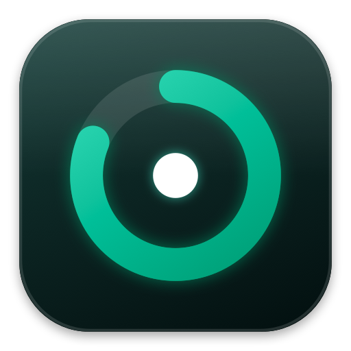
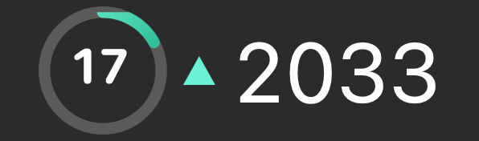
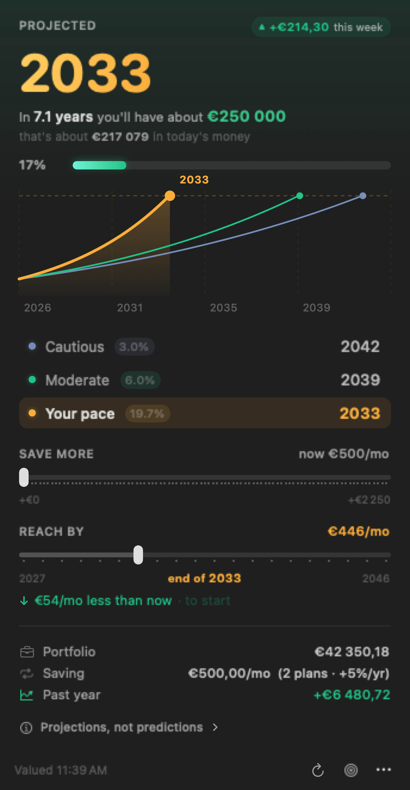
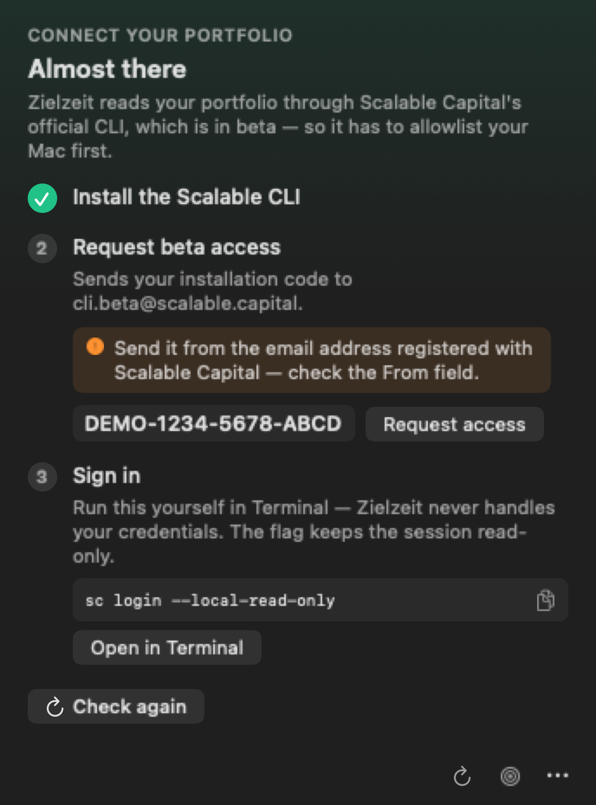

<p align="center">
  
</p>

<h1 align="center">Zielzeit</h1>

<p align="center">
  <strong>A Scalable Capital portfolio tracker for the macOS menu bar.</strong><br>
  <em>When will my portfolio reach my goal?</em>
</p>

<p align="center">
  
  
  
  
  
</p>

---

**Zielzeit** (German: *"finish time"*) is a free, open-source macOS menu bar app for
[Scalable Capital](https://scalable.capital) investors. It answers one question:
**when will my portfolio reach my goal?**

It reads your broker account through the official
[Scalable Capital CLI](https://github.com/ScalableCapital/scalable-cli) — read-only, no scraping, no
unofficial APIs, no credentials — and turns your balance, savings plan and trailing return into a
projected arrival year that sits in your menu bar.

<p align="center">
  <br>
  <em>17% of the way there, up on the week, projected to arrive in 2033.</em>
</p>

<p align="center">
  
</p>

<sub>Figures in every screenshot are synthetic demo data, not a real account.</sub>

## What it does

- **A projected year in your menu bar** — a progress ring with your percentage inside it, the year
  beside it, and a caret showing which way the market moved. No window to open, no tab to keep.
- **Three scenarios, one chart** — cautious (3%), moderate (6%), and *your pace*: the return your
  portfolio actually achieved over the trailing year, measured with the
  [simple Dietz method](https://en.wikipedia.org/wiki/Simple_Dietz_method) against your real deposits.
  The headline year uses your pace, so it moves with how you are actually doing.
- **Two what-if sliders** — *save more* previews what an extra €200/mo does to every projection,
  live; *reach by* inverts the question and tells you the monthly contribution that hits a year you
  pick.
- **Inflation, stated plainly** — the goal restated in today's money at the projected horizon, always
  on screen rather than behind a toggle.
- **Market movement** — tap the chip to cycle the window: today, this week, this month, 3 months,
  6 months, past year. The window is always named, because the sign genuinely differs between them.
- **Honest caveats** — the disclaimer quotes the actual rate, contribution and goal on screen, not
  boilerplate.

## Requirements

- **macOS 15** (Sequoia) or later — Apple silicon or Intel
- A **Scalable Capital** brokerage account
- The **official Scalable CLI** (`sc`), installed with [Homebrew](https://brew.sh), allowlisted by
  Scalable Capital and logged in — the app walks you through all three on first launch
- **Xcode 16 or later** (or an equivalent Swift 6 toolchain) — *only* if you build from source

## Download and install

**[⬇︎ Download the latest release](https://github.com/Mannafee/zielzeit/releases/latest)** — a
universal build that runs on both Apple silicon and Intel Macs. No Xcode, no Terminal.

1. Download **`Zielzeit.dmg`**, open it, and drag **Zielzeit** onto the **Applications** folder.
2. Open Zielzeit from Applications. **The first launch will be blocked** — see below.
3. Look for the progress ring in your menu bar.

### The first-launch warning is expected

macOS will say Zielzeit *"cannot be opened because Apple cannot check it for malicious software."*
That is not a sign anything is wrong with the download. Zielzeit is signed, but not *notarized* —
notarization requires a paid Apple Developer account, which this free project doesn't have.

To open it anyway:

> Go to  **System Settings → Privacy & Security**, scroll to the bottom, and click **Open Anyway**
> next to the message about Zielzeit. Confirm with Touch ID or your password.

You do this **once**. If you'd rather not, [build it from source](#build-it-yourself) instead — a
locally built app never gets flagged.

### One Terminal step you can't avoid

Zielzeit reads your portfolio through Scalable Capital's official command-line tool, and Scalable
requires that **you** install it and sign in yourself — the app is never given your credentials. So
even with the download, there is a one-time setup involving Terminal. Zielzeit walks you through it
with copy buttons for every command, but it is fair to know before you start:
see [Connecting to Scalable Capital](#connecting-to-scalable-capital).

Right-click the menu bar item for **Launch at login**, refresh, and quit.

## Build it yourself

Prefer to compile it? It takes about a minute and avoids the Gatekeeper prompt entirely.

```sh
git clone https://github.com/Mannafee/zielzeit.git
cd zielzeit
make run          # builds Zielzeit.app, ad-hoc signs it, and launches it
```

To keep it around permanently:

```sh
make install      # copies it to /Applications; needs an admin account
```

> `/Applications` is owned by `root:admin`, so on a standard (non-admin) macOS account `make install`
> fails on the copy. Use `sudo make install`, or just `make run` from the clone — the app works fine
> from anywhere.

`make uninstall` removes the app and the saved goal.

## Connecting to Scalable Capital

The Scalable CLI is in **beta and gated**: Scalable Capital has to allowlist your machine before it
can log in at all. That is a human round-trip that cannot be automated, so Zielzeit makes every step
around it one tap.

<p align="center">
  
</p>

1. **Install the CLI** — a copy button for
   `brew tap ScalableCapital/tap && brew install scalable-cli`.
2. **Request beta access** — Zielzeit reads your installation code and the **Request access** button
   opens a prefilled email to `cli.beta@scalable.capital`. Nothing to compose.
   ⚠️ **Send it from the email address registered with Scalable Capital.** They match the request to
   your account by sender, and a request from any other address is silently never answered. A
   `mailto:` link opens your *default* mail account, which often is not that one — check the From
   field.
3. **Sign in** — `sc login --local-read-only`, which **you** run yourself in Terminal. Zielzeit shows
   the command and can open Terminal with it typed but not executed.

Then set your goal — `100000`, `100.000`, `€100 000` and `100k` all parse. Amounts follow your system
locale, so a German-locale Mac shows `€42 350,18`.

### Three deliberate non-features

- **Zielzeit never bundles the CLI.** Apache 2.0 would permit it, but Scalable's own guidance is to
  trust only official artifacts — and a broker binary shipped inside a third-party app is exactly what
  that warns against.
- **Zielzeit never runs `sc login`.** It is an OAuth device-code flow and it is yours to complete. The
  app never sees your credentials.
- **Zielzeit recommends `--local-read-only`,** which stores the session in locally enforced read-only
  mode. That makes the read-only promise structural rather than editorial.

## Safety

Zielzeit is strictly read-only against your broker. It can run **exactly five commands** —
`sc broker overview`, `sc broker savings-plans`, `sc broker transactions`, `sc whoami` and
`sc installation-code` — enumerated in one Swift type with no other code path. There is no route to a
trade, to any other write command, or to `login`. Nothing leaves your Mac: no analytics, no network
call of its own, no account of any kind.

## The icons

<p align="center">
  
</p>

Both icons are **drawn in code**, not shipped as image files, so they stay crisp at any size and are
tuned in one place.

- **Menu bar** — a progress ring with your percentage inside it, filling as you approach your goal and
  becoming a checkmark when you get there. The caret beside it is emerald when the market is up, red
  when it's down, and absent when it hasn't moved. `make icons` renders every state, magnified.
- **App icon** — the same ring, glowing on a dark squircle. *Ziel* is German for **target**, so the
  mark is a target. `make icon` regenerates `Zielzeit.icns`.

## How the projection works

**Your realized return** uses the simple Dietz method, which approximates average invested capital by
assuming contributions arrive evenly through the year:

```
rate = gain₁ᵧ / (total − gain₁ᵧ − contributions/2)
```

Contributions are **measured**, not guessed: Zielzeit walks the trailing year of
`sc broker transactions` and sums deposits less withdrawals. (Securities movements are excluded — a
custody migration would otherwise look like a year's worth of deposits.) The rate is clamped to ±30%
and suppressed entirely when the capital base works out to zero or less, which is what happens for a
portfolio younger than a year, where deposits rather than growth explain the balance.

**Time to goal** solves the monthly-compounding balance equation for `t`:

```
t = ln((G·r + P) / (V·r + P)) / ln(1 + r)
```

where `r` is the monthly rate (converted geometrically, `(1+annual)^(1/12) − 1`), `P` the monthly
contribution, `V` the current value and `G` the goal. If your savings plan has **dynamization** (the
annual step-up Scalable applies), the contribution becomes a step function the closed form cannot
express, so Zielzeit walks forward one twelve-month block at a time and applies the same formula at
each year's contribution — exact, and conservative about when the raise lands, since the API doesn't
say.

The chart plots the same recurrence forward, and a test asserts each curve meets the goal line at
exactly the month the formula returns. That cross-check is what keeps the chart and the headline from
disagreeing.

**These are projections, not predictions.** They assume a constant return, smooth compounding, and an
uninterrupted savings plan — none of which is how markets or life work. Before tax. Not financial
advice.

## Contributing

Contributions are welcome. See **[CONTRIBUTING.md](CONTRIBUTING.md)** for the architecture, the make
targets, the two UI harnesses, and how to exercise every state without touching a real account.

The short version:

```sh
make test     # 229 unit tests, all in ZielzeitCore
make once     # print the report as text — fastest check of the numbers
make ui       # rasterize the popover, light and dark
make help     # every target
```

One rule matters more than the rest: **all arithmetic lives in `ZielzeitCore`, all UI in `Zielzeit`.**
No `import SwiftUI` in the core, no math in the views. That split is what makes the projections
testable and the harnesses possible.

## Disclaimer

Zielzeit is an **independent, unofficial** open-source project. It is not affiliated with, endorsed
by, or supported by Scalable Capital GmbH. "Scalable Capital" is their trademark, used here only to
describe what this app reads. Use at your own risk; the figures it shows are projections, and nothing
in it is financial advice.

## License

[MIT](LICENSE) © Istiaque Mannafee Shaikat

---

<sub>**Keywords:** Scalable Capital · scalable-cli · macOS menu bar app · portfolio tracker ·
investment goal calculator · FIRE calculator · compound interest projection · savings plan ·
Sparplan · Depot · ETF portfolio · Dietz return · Swift · SwiftUI · Swift Charts</sub>
